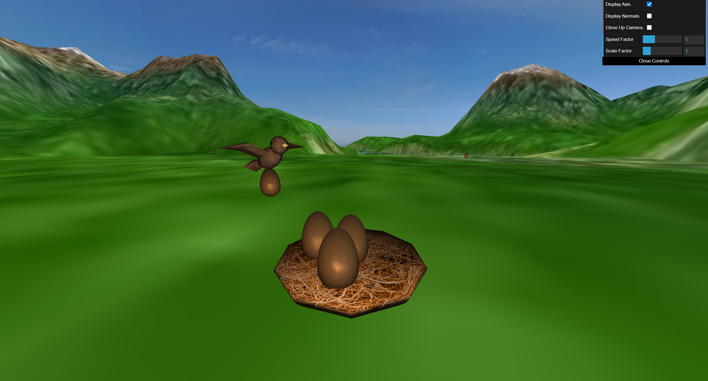

# CG 2022/2023 - Project

## Observations

- When starting the server the camera will start close to the center of the terrain and very high up. However, in the GUI there is a checkbox titled `Close Up Camera` which when checked will have the camera following the bird from behind at a fixed distance. At this point, the checkbox can be unselected and the camera will remain in the last position it was and the user has full control again, being able to zoom in or out and move around to be able to better view whatever he chooses.
- For section 7 of the script, we chose the point A where we added a free fall for the egg with improved animation and physics (these will imitate the fall of an object with or without horizontal velocity, according to the acceleration of gravity on Earth, rounded to 9.8, with 0 wind resistance). 
- Links for the tree textures used: 
    - `https://www.google.com/search?q=tree%20billboard%20textures&tbm=isch&tbs=ic:trans&client=opera-gx&hs=ycf&hl=pt-PT&sa=X&ved=0CAMQpwVqFwoTCLDBlaSM-v4CFQAAAAAdAAAAABAE&biw=1864&bih=931#imgrc=hzMr-QfSjgwkFM`
    - `https://www.google.com/search?q=tree%20billboard%20textures&tbm=isch&tbs=ic:trans&client=opera-gx&hs=ycf&hl=pt-PT&sa=X&ved=0CAMQpwVqFwoTCLDBlaSM-v4CFQAAAAAdAAAAABAE&biw=1864&bih=931#imgrc=wkyybbkBmrNSkM`
    - `https://www.google.com/search?q=tree%20billboard%20textures&tbm=isch&tbs=ic:trans&client=opera-gx&hs=ycf&hl=pt-PT&sa=X&ved=0CAMQpwVqFwoTCLDBlaSM-v4CFQAAAAAdAAAAABAE&biw=1864&bih=931#imgrc=Q9TMKd9eNGxlzM`

## Screenshots

### Panorama and terrain in early stage as seen from the outside:

 

### View from inside the panorama after completion of section 2:

 

### Bird model (after changes made):

 

### View of the terrain, capturing the lake area and the flat zone where the bird, nest and eggs lie:

 

### Aerial image of the terrain:

#### Note the terrain was scaled down to help visualization

 

### Bird picking up and dropping eggs in the nest:

#### Part of section 5, displays the eggs in some predefined positions in the nest and the bird carrying an egg

 

### Flat area of the terrain with the tree row and group patch included (bird, eggs and nest also visible):

 

### Bird dropping egg with improved bird egg fall (Section 7 alternative A):

#### Egg falls in an arc according to the speed it was moving at the moment it was dropped (hard to see in an image, visible in the video and when running the program)
