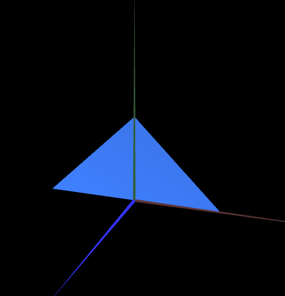

# CG 2022/2023

## TP 1 Notes

- In exercise 1 we observed that the objects are made of vertices numbered by their index with coordinates that make up triangles by the way they are connected, counter-clockwise for the visible part and clockwise for the backside.
- In exercise 1 3. to show the paralellogram as a double-sided figure we replicated the object in both clockwise and counter-clockwise direction of vertices (Eg. triangle with vertices numbered 1 2 3 would be defined as 1 2 3 and 3 2 1).

- In exercise 2 we added both triangles in a similar way being the big one with the double value of the coordinates of the smaller one.

