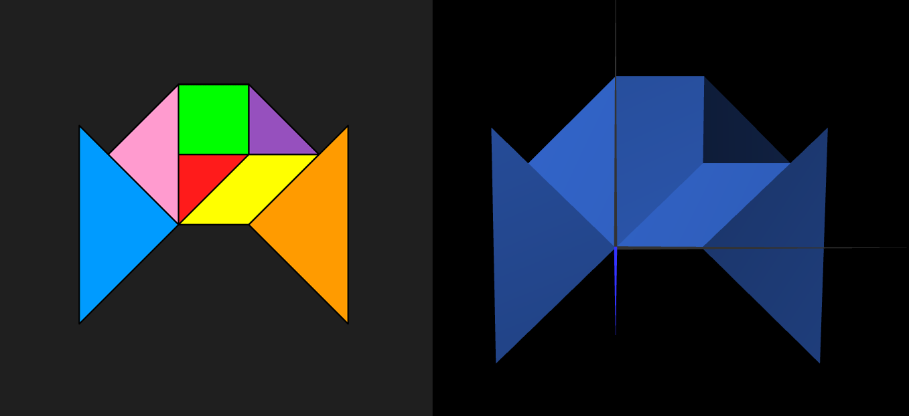
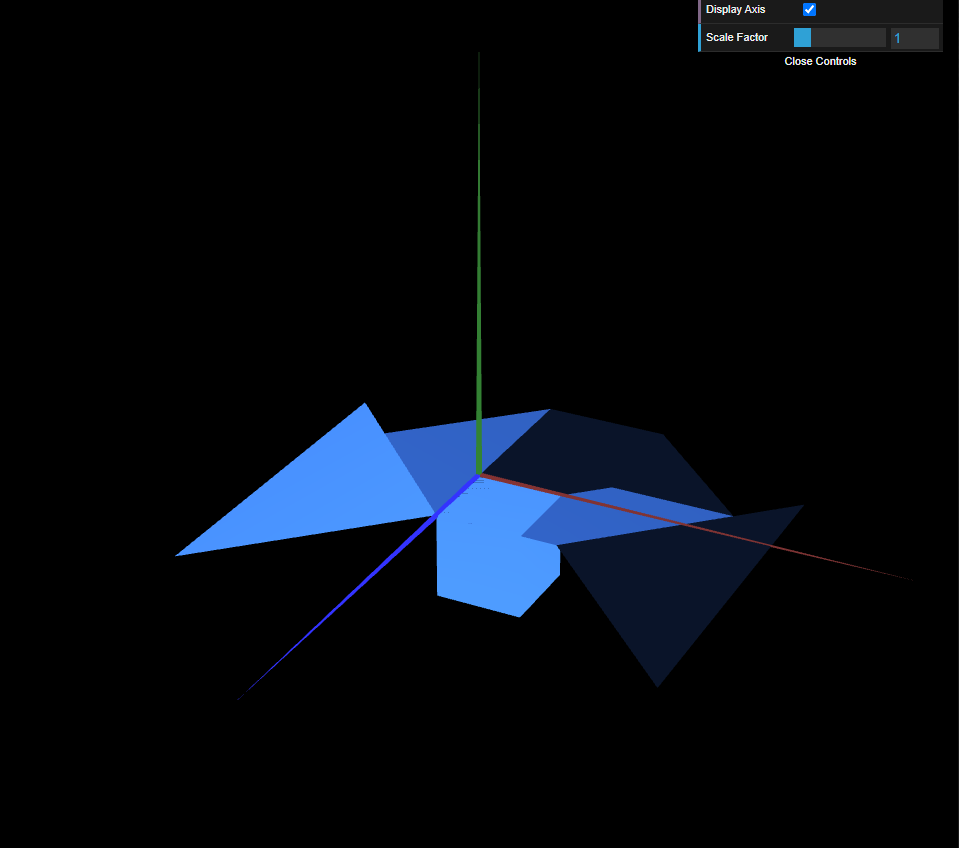
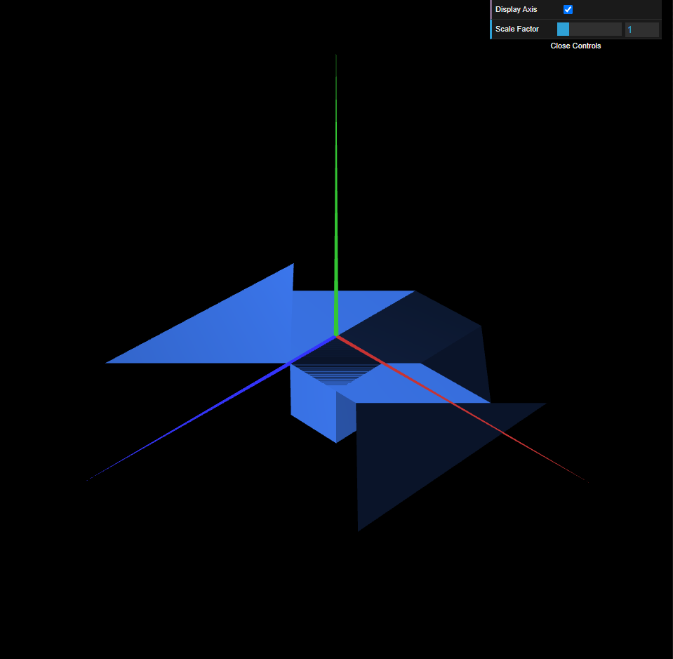

# CG 2022/2023

## TP 2 Notes

### Section 2

- Considering we have the tangram 108, we assumed the vertice of the origin (0,0,0) as the bottom vertice of the small red triangle.
- In exercise 1 of section 2, under the display() we defined the matrix to the operators, one for the rotation and another for the translation. 
- They both are the transpose of the expected matrix because of how OpenGL reads them. 
- After defining the matrixes we call multMatrix() for them in the reverse order of operations and then display the diamond.
- In exercise 2, we made use of the functions rotate(angle,x,y,z), translate(x,y,z) and scale(x,y,z) to rotate, translate and alter the scale of the figures, we also had to call *CGFscene.pushMatrix()* to set the draw point in the origin before drawing each figure and then after drawing each figure we used the function *CGFscene.popMatrix()* to discard it. We also made use of the *scale(x,y,z)* function with negative attributes in order to get the reverse of a figure so that it fitted our tangram (we used *scale(-1,1,1)* for our parallelogram). 
- We had difficulty with where to put the instructions *pushMatrix()* and *popMatrix*(), and initially ended up having the objects to appear in different origins everytime contrary to what was expected, which difficulted this task. After noticing the mistake we corrected all the transformations we made to be based on the origin of the axis.  
- In the 3rd exercise, we created the class MyTangram where we displayed all the pieces of our tangram together. To accomplish that, we initialized the object for each figure that made up our tangram in the constructor of the tangram class. Then, we created the function *MyTangram.display()* where we placed all the code we had previously wrote in the *display()* function of the scene regarding the drawing of each figure of the tangram and made the required syntax ajustments (e.g. using `this.scene`. instead of `this.` so the `this` continues to refer to the scene). 

### Section 3

- In exercise 1 from section 3 we created a new class *MyUnitCube* where we declared 8 vertices and their correspondent connections in triangles to form a cube. While doing so, we had to make sure the connections were in the right order so the cube would be visible from the outside. Comments were added to facilitate these tasks.
- In exercise 2 and 3 from section 3 we added the necessary code to make the cube visible in the server.
- For exercise 4 and 5 from section 3 we made the transformations needed to the tangram and then we did the same to the cube. It is to be noted that we considered the back left vertice from the top face of the cube as the top left vertice.

### Section 4

- In this section, we used 6 squares (MyQuad) and performed the required transformations in order to form a unit cube. The result was similar to the one from section 3, as we verified in exercise 3 of this section where we replaced the unitCube by the unitCubeQuad and obtained the same end result. 

