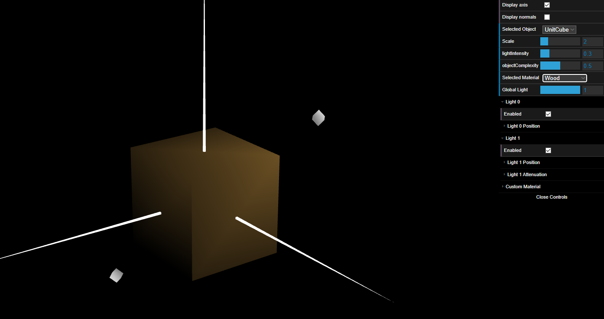

# CG 2022/2023

## TP 3 Notes

### Part 1

- On exercise 1 and 2 of this part we were able to spot how having innapropriate normals influences the illumination of an object (the cube in this case).
- On exercise 3, to properly add the correct normals to each face of the cube we had to create for each vertice, 2 additional ones (since each vertice of a cube shares 3 faces of said cube and therefore 3 normals) and then in the same number, the corresponding normals.
- On exercise 4, in MyScene we added a new material wood with low specular component. Which means this material has low ambient and specular and in the diffuse component the RGB code for the wood color in values between 0 and 1 instead of the traditional 0 to 255, applied it to the cube through the Selected Material toggle and saw the result with the light 0. 

- On exercise 5, we followed the same logic as in exercise 4 but this time using the specular component instead of the diffuse one. The difference was that to apply the materials to the corresponding pieces accordingly to the original tangram, in MyTangram class before displaying each one of the pieces we apply the correct material to the scene.
- On exercise 6, we just had to do the same thing to the already created custom material in the diamond.

### Part 2

- For exercise 7, we started by adapting the code of the pyramid. We made the base of the prism parallel to the x and y axis and to calculate the vertices we divided 2*PI by the number of slices we would have so we could figure out the angle of increment between each slice (alpha) and used sin(angle) to get the y coordinate and cos(angle) to get the x coordinate (angle started at 0 and with each slice was incremented +alpha). In each cycle of the for loop (going through each slice) we would generate the vertices, normals and indices of 1 slice of the prism. Regarding the normals, each slice had the same vector of normal for all 4 vertices and we calculated this vector by using the center of the prism (being that coordinate `O(0,0,0)`) and the vertice M which is the middle point of the segment drawn between the 2 vertices of that slice with the z coordinate as 0 (being those 2 vertices for example `A(x1, y1, z1)` and `B(x2, y2, z2)` then middle point M would be `M((x1+x2)/2,(y1+y2)/2,0)` and vector `OM = M - O = ((x1+x2)/2,(y1+y2)/2,0) - (0, 0, 0) = ((x1+x2)/2,(y1+y2)/2,0) => M`). Finally we normalized the result of the normals. 
- Commenting the affirmation, we do belive these normals provide constant shading, in the way they are calculated, because they are just calculated once and then replicated for the rest of the vertices of the polygon and there is a Mach Band effect.

- In exercise 8 we displayed the prism and executed a translation followed by a rotation to get the prism vertical (we considered the prism vertical where the height of the prism was parallel to the y axis and its base with y=0)

- In exercise 9, by adding another *for* loop, that went through the number of stacks, when creating the prism we made it possible to create the prism with varying stacks which maintains the length of 1 in the Z axis but increases the density of normals and vertices in each face of the prism.

### Part 3

- We created a MyCylinder copying the MyPrism instance and changing the normals so that they correspond to the vertices coordinates, in a way, that each vertice has only one normal.
- After that we removed the duplicated vertices and normals because so that the same lines share the same normals.
- The final result, was indeed better than the previous one, and got us a shading with a similar result to the smoothed shading of the Gouraud Method, in which, the color of the other vertices are calculated with bilinear interpolotation.

