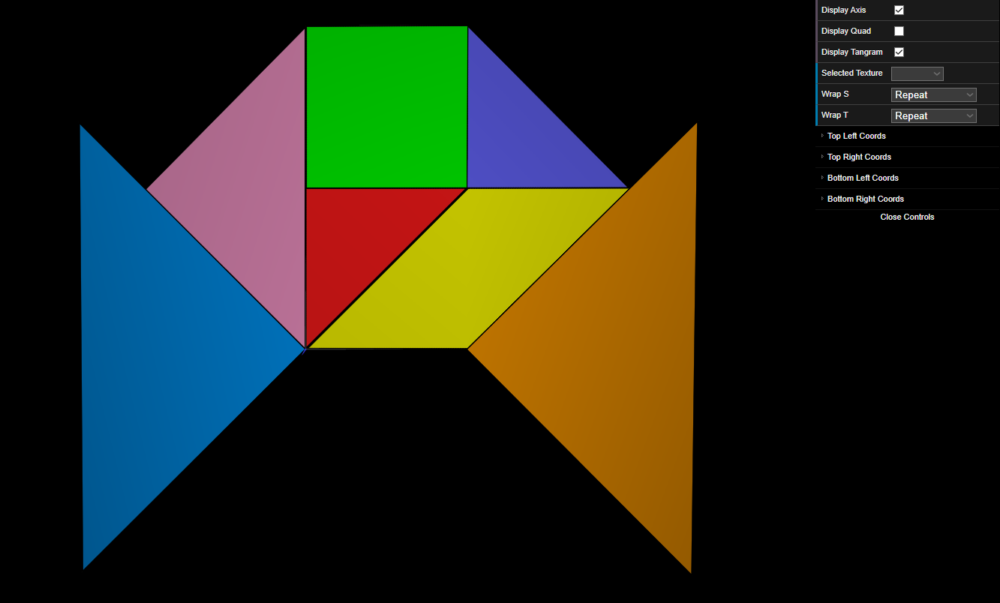
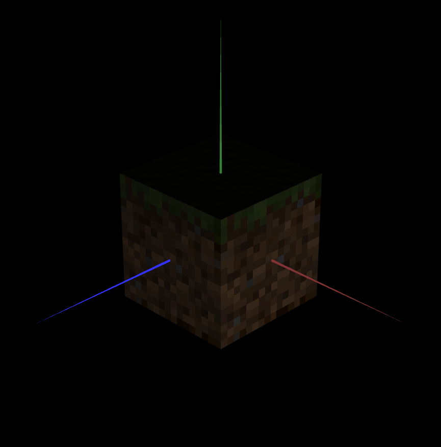

# CG 2022/2023

## TP 4 Notes

### Exercises

- For exercise 1, we created a material in the MyScene class with the texture "tangram.png". Although it is not used, this material uses the "REPEAT" texture wrap for s and t.

- In exercise 2 and 3, we created the texture coordinates, to do this, for each vertice of each figure we assigned the corresponding vertice in the tangram.png image considering the s and t axis and values between 0.0 and 1.0. 
- For shapes with different textures we pass in the constructor one boolean that defines which color it is assigned to each figure.

- For exercises 4, 5 and 6 we added the cube from the previous tp2 into the scene and added in its constructor 6 more arguments representing the textures of each side of the cube. These textures were applied by: creating a new material for the cube then applying the desired texture to the material using `cubeMaterial.setTexture(<desired_texture>);` and then `cubeMaterial.apply();` to apply the changes. We did this for each side being drawn (just before the `.display()`). We also observed the image of the texture would appear blurry due to the difference between the original size and the dimension of the cube.

- In exercise 7 we corrected the blurring by applying Nearest Filtering instead of Linear Filtering by calling the command `this.gl.texParameteri(this.gl.TEXTURE_2D, this.gl.TEXTURE_MAG_FILTER, this.gl.NEAREST);` before each `.display();` call in the display function of the class MyUnitCubeQuad. This resulted in the following cube:

