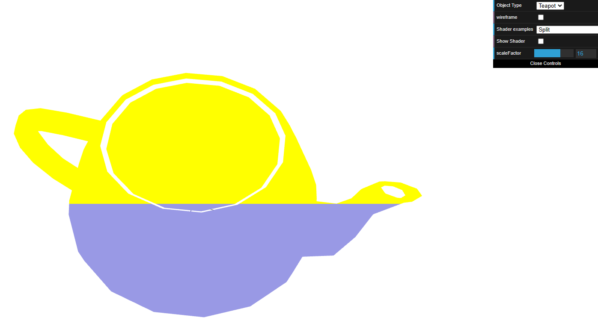
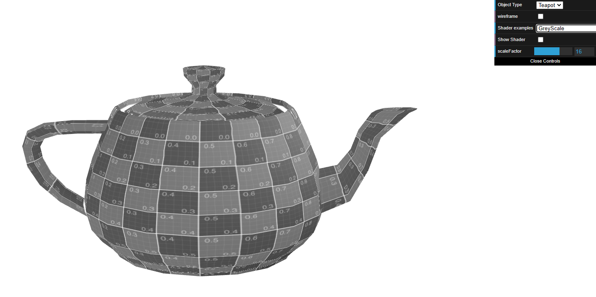
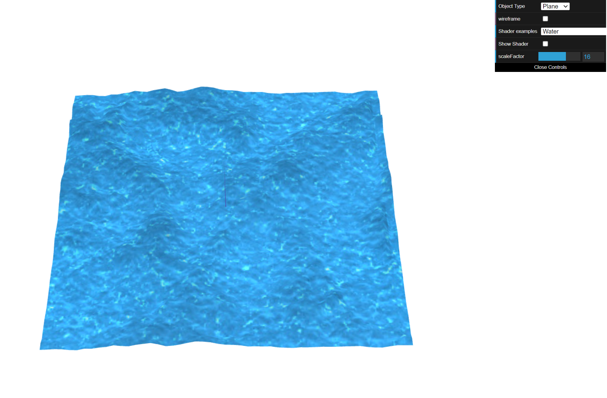

# CG 2022/2023

## TP 5 Notes

### Exercises

- In exercise 1, we created new slipt.vert and split.frag files and based on the varying shaders we added the condition that depending on if the y coordinate is more than 0.5 then the FragColor is yellow, and if it is less the FragColor is blue. The colors are in rgba in the vec4.

- We also changed the animation in texture3anim by adding a new offset that the multiplies the timefactor with normscale in the x coordinate mantaining the others coordinates, creating this way a sinusoidal movement from back to forward which the speed is influenced by the scaleFactor.
- Finally, we created a new grayscale fragment shader which was exactly like the sepia one but with greay colors instead.

- In exercise 2, we created the new water shaders and in the ShaderScene changed the texture maps to the new jpgs.
- Then, in the water shaders we changed the filter so we stop seeing the dark red colors, and instead see a darker blue. To see the use the waterMap as a height texture map we added an offset that multiplies in the z coordinate the aVertexNormal with the value and added to the gl_Position.
- In the end, we added to the value a vector that the multiplies the timeFactor to the value used previously.

